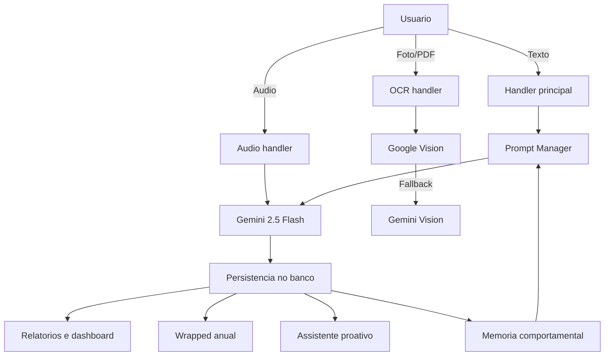

<div align="center">
  
  
  
  
  
</div>

<h1 align="center">ContaComigo</h1>

> **Assistente financeiro no Telegram com IA multimodal, OCR e automacao de lancamentos.**

---

## Visao geral

O **ContaComigo** eh um bot no Telegram para controle financeiro pessoal com foco em **baixo atrito**.
O usuario registra gastos por texto, audio ou foto e recebe analises em linguagem natural.

Principais entradas:
- Texto natural: "Gastei 55 reais no mercado".
- Audio (mensagem de voz): transcricao e extracao automatica.
- Foto/PDF de nota fiscal: OCR com validacao.

Saidas:
- Insights personalizados.
- Relatorios em PDF.
- Dashboard web.

---

## Funcionalidades

Entrada e lancamentos:
- **Audio (frictionless):** processa `filters.VOICE` com Gemini 2.5 Flash.
- **OCR robusto:** Google Vision com fallback para Gemini Vision.
- **Fatura PDF (Inter):** importacao via comando `/fatura` com confirmacao.
- **Entrada manual guiada:** conversa passo a passo para registrar gastos.
- **Edicao de transacoes:** ajuste de valor, categoria, conta e descricao.

Analise e IA:
- **Conversa natural:** analises e comandos por linguagem humana.
- **IA dedicada:** insights, economia, comparacoes e alertas.
- **Memoria comportamental:** resumo semanal do perfil do usuario para personalizar respostas.
- **Assistente proativo:** alertas de gastos fora do padrao, metas em risco e assinaturas recorrentes.
- **Dados externos:** cotacoes, indicadores, cripto, cambio e noticias.

Planejamento e visao:
- **Metas financeiras** com plano mensal, progresso visual e check-in mensal.
- **Agendamentos recorrentes** com parcelas e frequencia definida.
- **Investimentos e patrimonio** com dashboards dedicados.

Engajamento e relatatorios:
- **Gamificacao:** XP, niveis, ranking em tempo real e streaks.
- **Graficos avancados** (pizza, barras, linha, area e composicoes).
- **Relatorios PDF** e **dashboard web**.
- **Wrapped anual** (retrospectiva financeira automatica).
- **Contato e suporte** via fluxo conversacional.

---

## Exemplos rapidos

Texto natural:
- "Gastei 89,90 no mercado ontem"
- "Mostre meus gastos com transporte este mes"

Audio:
- Envie uma mensagem de voz com o gasto narrado.

OCR:
- Envie foto ou PDF de nota fiscal.

Fatura (Inter):
- Use `/fatura` e envie o PDF do Banco Inter.

---

## Stack principal

- **Python 3.12+**
- **python-telegram-bot 22.x**
- **google-generativeai** (Gemini)
- **google-cloud-vision**
- **SQLAlchemy 2.x** + **PostgreSQL**
- **Flask** + **gunicorn** (dashboard)
- **APScheduler** (jobs)
- **ReportLab** (PDF) + **Jinja2** (templates)
- **matplotlib / plotly / seaborn** (graficos)

---

## Documentacao complementar

- Arquitetura: [ARCHITECTURE.md](ARCHITECTURE.md)
- Changelog: [CHANGELOG.md](CHANGELOG.md)
- Licenca: [LICENSE](LICENSE)

---

## Arquitetura (resumo)

Para detalhes, consulte [ARCHITECTURE.md](ARCHITECTURE.md).

- [bot.py](bot.py): ponto de entrada do bot.
- [gerente_financeiro/handlers.py](gerente_financeiro/handlers.py): fluxo principal.
- [gerente_financeiro/audio_handler.py](gerente_financeiro/audio_handler.py): audio e Gemini.
- [gerente_financeiro/ocr_handler.py](gerente_financeiro/ocr_handler.py): OCR.
- [gerente_financeiro/ai_memory_service.py](gerente_financeiro/ai_memory_service.py): memoria comportamental.
- [gerente_financeiro/assistente_proativo.py](gerente_financeiro/assistente_proativo.py): alertas inteligentes.
- [gerente_financeiro/ia_handlers.py](gerente_financeiro/ia_handlers.py): comandos de IA (insights, economia, comparacoes, alertas).
- [gerente_financeiro/investment_handler.py](gerente_financeiro/investment_handler.py): investimentos e patrimonio.
- [gerente_financeiro/metas_handler.py](gerente_financeiro/metas_handler.py): metas e progresso.
- [gerente_financeiro/agendamentos_handler.py](gerente_financeiro/agendamentos_handler.py): recorrencias e parcelas.
- [gerente_financeiro/editing_handler.py](gerente_financeiro/editing_handler.py): edicao de transacoes.
- [gerente_financeiro/graficos.py](gerente_financeiro/graficos.py): graficos.
- [gerente_financeiro/relatorio_handler.py](gerente_financeiro/relatorio_handler.py): relatorios.
- [gerente_financeiro/prompt_manager.py](gerente_financeiro/prompt_manager.py): prompts e templates.

---

## Fluxo (resumo visual)



---

## Como rodar localmente

### Requisitos

- Python 3.12+
- PostgreSQL 14+
- Credenciais do Telegram e Google (Vision/Gemini)

### Instalacao

```bash
git clone https://github.com/henrique-jfp/ContaComigo.git
cd ContaComigo

python -m venv .venv
source .venv/bin/activate

pip install -r requirements.txt
```

### Variaveis de ambiente

Defina as variaveis abaixo (arquivo `.env` em dev ou variaveis do sistema):

```
TELEGRAM_TOKEN=
GEMINI_API_KEY=
GEMINI_MODEL_NAME=gemini-2.5-flash
DATABASE_URL=
GOOGLE_APPLICATION_CREDENTIALS=
EMAIL_HOST_USER=
EMAIL_HOST_PASSWORD=
SENDER_EMAIL=
EMAIL_RECEIVER=
PIX_KEY=
```

Observacoes:
- `GEMINI_MODEL_NAME` aceita valores listados em [config.py](config.py).
- `GOOGLE_APPLICATION_CREDENTIALS` pode ser caminho absoluto ou relativo.

### Executando

```bash
python bot.py
```

Abra o bot no Telegram e envie `/start`.

---

## Deploy

- Docker: use [Dockerfile](Dockerfile) e [start.sh](start.sh).
- Producao: configure variaveis de ambiente e banco PostgreSQL.

---

## Jobs e memoria comportamental

Jobs principais:
- `job_atualizar_perfis_ia`: atualiza o campo `perfil_ia` semanalmente.
- `job_assistente_proativo`: alertas inteligentes diarios.
- `wrapped_anual`: retrospecao anual automatica.

Veja [gerente_financeiro/ai_memory_service.py](gerente_financeiro/ai_memory_service.py) e [jobs.py](jobs.py).

---

## Privacidade e seguranca

- Dados sensiveis ficam no banco configurado em `DATABASE_URL`.
- Tokens e chaves sao lidos por variaveis de ambiente.
- Fluxo de exclusao de usuario disponivel.

---

## Contribuicao

Contribuicoes sao bem-vindas via Issues e Pull Requests. Para discussoes comerciais, use o contato abaixo.

---

## Licenciamento

Este projeto usa **Licenca Dupla (Dual License)**:

| Tipo de uso | Status | Detalhes |
|---|---|---|
| Portfolio/Educacao | Gratuito | Estudar, demonstrar, rodar localmente |
| Comercial | Pago | Producao, white-label, monetizacao |

Contato para licenca comercial: **henriquejfp.dev@gmail.com**

---

## Contato

- Telegram: [@ContaComigoBot](https://t.me/ContaComigoBot)
- LinkedIn: [henrique-jfp](https://linkedin.com/in/henrique-jfp)

---

<div align="center">

Se o projeto ajudou, deixe uma estrela.

</div>
